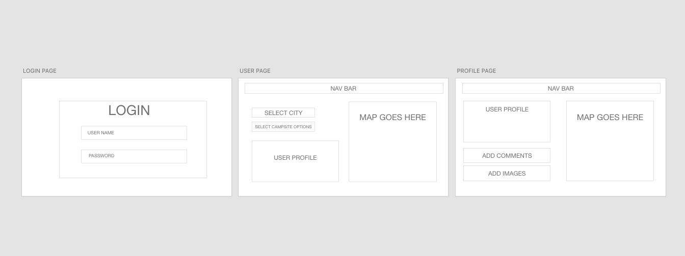
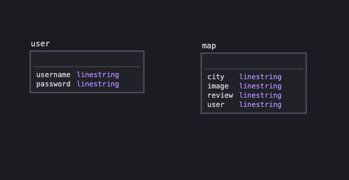

# Park Pal 🏕️

Park Pal helps users share their camping experiences with other campers.

Post your own favorite camping spots or see where other users have been using the interactive map view.

    

## Task Breakdown

- Erik: MongoDB structuring & connection
- Jacob: Express server creation
- Nick: React UI & styling

## Tentative Schedule for Completion

- 1/21 — scaffolding and connected front and back ends
- 1/22 — database connected database seeded
- 1/23 — user auth
- 1/24 — home page feed working
- 1/25 — search by user
- 1/26 — MVP completed
- 1/27 — Polish UI
- 1/28 — Testing
- 1/29 — Present

## Mockup

## Data Model

